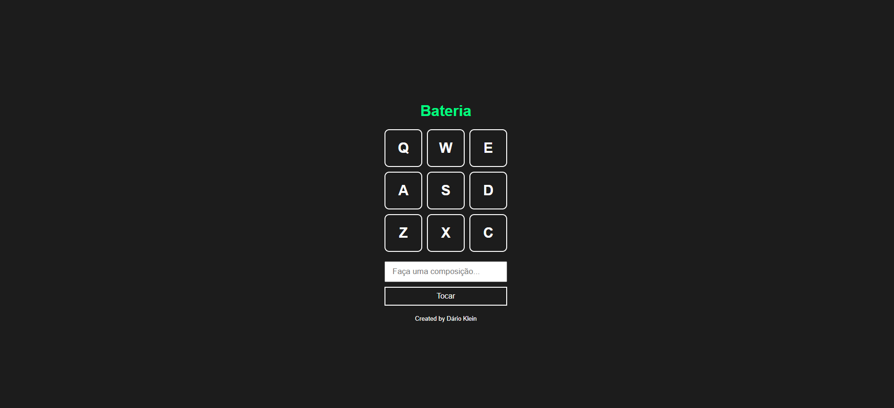

<h1 align="center"> Bateria </h1>

Uma bateria básica desenvolvida para produção de composições simples para músicos! 

 

  

## 🚀 Tecnologias

Esse projeto foi desenvolvido com as seguintes tecnologias:

- HTML e CSS
- JavaScript
- Git e Github

## 💻 Projeto

Desenvolvido através das aulas da B7WEB com o professor Bonieky, para aprimoramento das habilidades em JavaScript.

## Créditos

Feito por Dário Klein ♥ 
